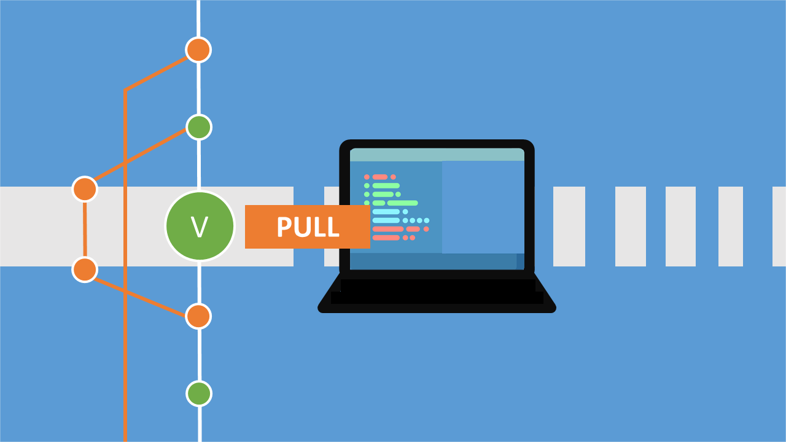

 


<!-- truncate -->

```bash title='拉取所有更新，不同步'
git fetch --all
```

```bash title='本地代码同步线上最新版本(会覆盖本地所有与远程仓库上同名的文件)'
git reset --hard origin/<BranchName> 
```

注意：第二条中最后的分支 `<BranchName>` ，如果是在分支开发的话，就写某个分支的名字。

```bash title='再更新一次（其实也可以不用，第二步命令做过了其实）'
git pull            
```