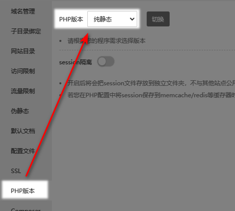
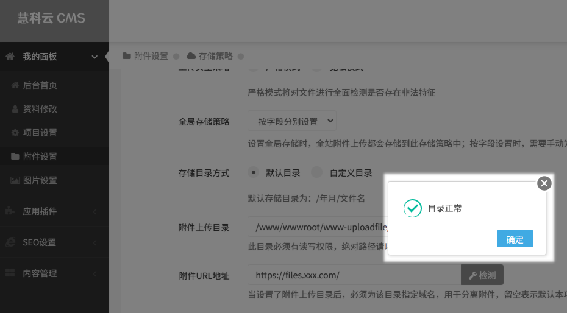
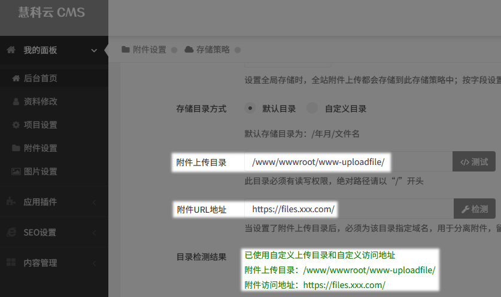

:::caution 注意
本教程需要具备PHP技术或者服务器运维技术

:::

网站安全首选需要让能通过web域名访问的目录都设置为不可写入权限，这样能有力保证服务器不被恶意写入非法的文件。

```html title='本教程例子中的网站 web 目录假设为'
/www/wwwroot/[你的域名]/
```

## 分离 dayrui 系统核心程序目录

dayrui 目录是程序文件目录，存储的 php 业务逻辑程序文件，通常情况下需要具备可读写权限

1. 将 dayrui 目录移动到指定目录，例如 `/www/wwwroot/www-dayrui/`
2. 打开 web 目录的 index.php
3. 查找 `系统核心程序目录`

```html title='将代码'
define('FCPATH', dirname(__FILE__, 2) .'/dayrui/');
```

```html title='修改为'
define('FCPATH', '/www/wwwroot/www-dayrui/');
```

4. 赋予新的 `www-dayrui` 可读写权限，如果网站正常访问就表示ok了

## 分离 cache 缓存文件存储目录

cache目录必须具备可写入权限，默认可以通过web访问其内容，推荐把cache目录分离到其他目录（SSD硬盘最佳）

1. 将 cache 目录移动到指定目录，例如 `/www/wwwroot/www-cache/`
2. 打开 web 目录的 index.php
3. 查找 `缓存文件存储目录`

```html title='将代码'
define('WRITEPATH', dirname(FCPATH).'/cache/');
```

```html title='修改为'
define('WRITEPATH', '/www/wwwroot/www-cache/');
```

4. 赋予新的 `www-cache` 可读写权限，如果网站正常访问就表示 ok 了

## 分离 template 模板文件目录

template目录是存放模板文件的，实际项目中不建议将其暴露在web目录中，推荐进行分离

1. 将template目录移动到指定目录，例如 `/www/wwwroot/www-template/`
2. 打开web目录的 index.php
3. 查找 `模板文件目录`

```html title='将代码'
define('TPLPATH', dirname(FCPATH).'/template/');
```

```html title='修改为'
define('TPLPATH'， '/www/wwwroot/www-template/');
```

4. 赋予新的 `www-template` 可读写权限，如果网站正常访问就表示ok了

## 分离 uploadfile 附件存储目录

uploadfile目录是附件存放的目录，安全起见，强烈推荐进行分离

1. 将uploadfile目录移动到指定目录，例如 `/www/wwwroot/www-uploadfile/`
2. 再web服务器中为此目录绑定一个域名，例如：`files.xxx.com`
3. 为了安全，必须设置此网站为纯静态，以宝塔BT服务器为例的配置：



纯静态的目的是为了此目录下的不允许执行php文件，增强被非法写入的安全性

4. 进入cms后台，系统，附件设置


5. 修改后需要 `测试` 和 `检测`




