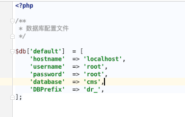

## 修改数据库配置

```html title='系统框架的数据库配置文件'
config/database.php
```

### `hostname`

数据库服务器地址

### `username`

数据库用户名

### `password`

数据库密码

### `database`

数据库名称

### `DBPrefix`

数据表前缀



带端口的写法是：127.0.0.1:330

## 验证数据库是否可用

### 下载探针工具

[<icon icon="fa-regular fa-file-zipper" size="lg" /> 探针.zip](/探针.zip)

### 测试数据库连接


