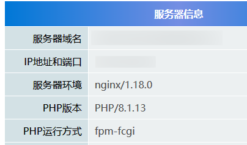
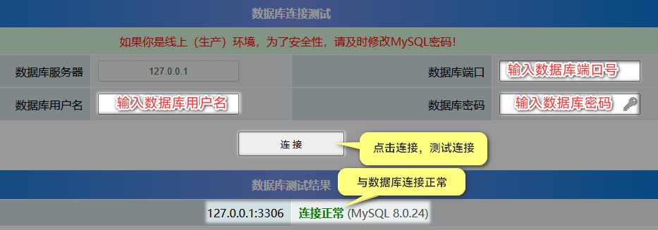

## 下载探针工具

[<icon icon="fa-regular fa-file-zipper" size="lg" /> 探针.zip](/探针.zip)

```html title='解压后的tz.php文件放到网站目录中，并通过url进行访问'
https://[你的域名]/tz.php
```

如果能正常打开的话，表示你服务器支持php程序。

## 看php版本是否支持



## 查mysql数据库账号是否正确



cms数据库配置文件在config/database.php，把账号等信息填写上去，点测试
