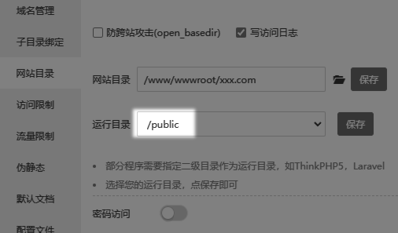

## 下载程序源码

[<icon icon="fa-regular fa-file-zipper" size="lg" /> 慧科云CMS安装包.zip](https://cms.13aq.com/慧科云CMS-安装包.zip)

## 部署系统

1. [检查环境是否支持本程序](../环境配置/检查环境支持情况/)
2. 解析域名 
3. 将源码解压上传到空间根目录，并将 **`public`** 设置为运行目录

                            
## 开始安装程序

```html title='运行网站根目录的 install.php 文件进入安装程序'
https://[你的域名]/install.php
```                       
