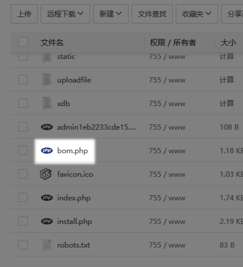
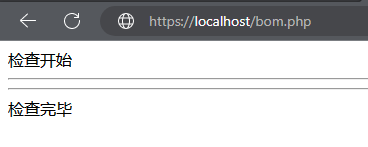
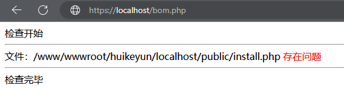
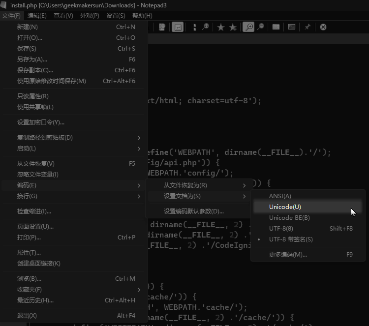

代码编写环境工具推荐使用：notepad 3、Sublime Text 3、IntelliJ IDEA 等编辑器工具；

注意，一定不要使用文本编辑器（如记事本、写字板等），会给你编辑的东西前面加上一些东西，可能会导致莫名其妙的错误。

如果网站后台打不开，一片空白，可以下载一个 php 检测文件，检测一下系统是否被非法串改过。

## 下载脚本

[<icon icon="fa-regular fa-file-zipper" size="lg" /> bom.zip](./bom.zip "bom.zip")

## 解压文件

将 `bom.php` 文件放到网站根目录中

## 运行这个文件

上图没有红色字体表示正常，如果存在红色字体就表示不正常，需要手动修改红色字体的文件。

如果存在红色字体 `存在问题`，使用编辑软件去掉

打开文件，使用UTF8无BOM（无带签名）格式的编码

