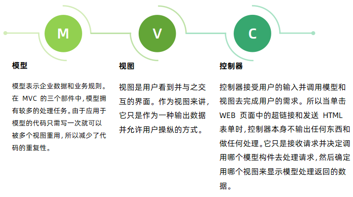

# 慧科云 CMS 介绍

慧科云 CMS 内容管理框架是基于 PHP 语言采用 CodeIgniter 作为开发框架生产的网站内容管理框架，提供“电脑网站+手机网站+多终端+ APP 接口”一体化网站技术解决方案。她拥有强大稳定底层框架，以灵活扩展为主的开发理念，二次开发方便且不破坏程序内核，为 Web 艺术家创造的
PHP 建站程序，堪称 PHP 万能建站框架。

团队长期从事 CMS 建站系统研发，从2009年研发 FineCMS，轻量级内容管理深受广大用户的好评。

任何 CMS 程序都要经过长时间的打磨和技术累积，没有技术沉淀的程序是经不起考验的。

## 用途

慧科云 CMS 可以在多种终端来调用和展示这些内容，例如：

## 运行环境

LA(N)MP(Linux+Apache/Nginx+MYSQL+PHP)这一经典的 Web 开发与生产平台以其廉价的构建成本、高效的运行性能以及良好的可维护性。

慧科云 CM S正是基于这样一个强大的平台而开发的，它继承了这一平台的稳定、高效、良好的可维护性和灵活的可扩展性，如模块化开发和优雅高效的框架+模块架构等，这使您在使用慧科云 CMS 来开展业务时，完全不用担心因性能或安全问题对业务带来的影响，更能专注于业务本身的发展，而不是被繁琐的技术细节所累。

## 技术架构

CodeIgniter 是一个小巧但功能强大的PHP框架，作为一个简单而“优雅”的工具包，它可以为开发者们建立功能完善的 Web 应用程序。

CodeIgniter采用 MVC 设计模式，它强制性地使应用程序的输入、处理和输出分开，使用 MVC应用程序被分成三个核心部件：模型(M)、视图(V)、控制器(C)，它们各自处理自己的任务。

